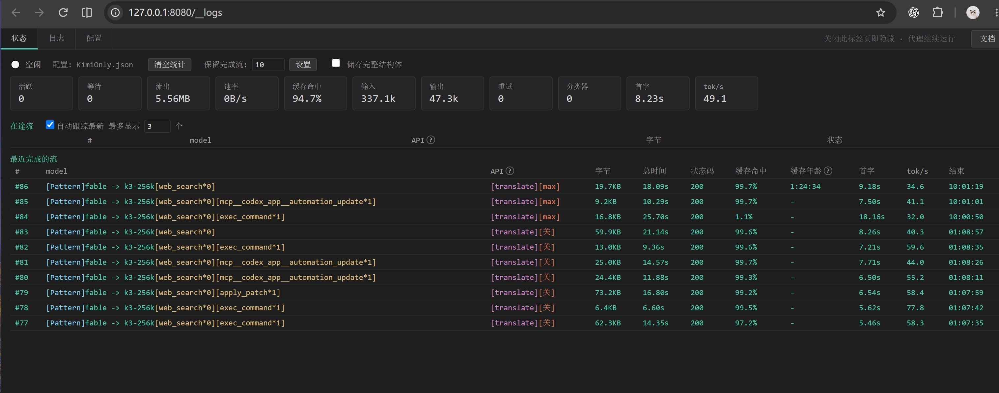
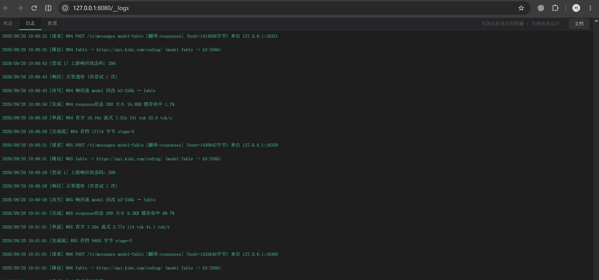
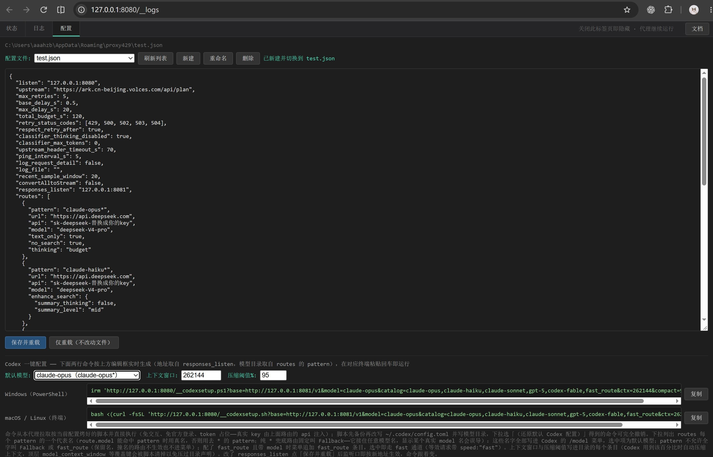

# Proxy429

[English](#english) | [中文](#中文)

---

## English

A local LLM API proxy that keeps AI coding agents (Claude Code, Codex CLI,
and other OpenAI/Anthropic-compatible clients) unaffected by flaky model
providers.

- **Automatic retry with exponential backoff** on 429/5xx — including
  rate-limit errors hidden inside HTTP-200 SSE streams — with SSE keep-alive
  pings so the client never times out while the proxy retries.
- **Model routing**: wildcard routing across providers, dedicated routes for
  safety-classifier and fast-mode requests, multimodal and web-search
  fallbacks.
- **Protocol translation**: OpenAI Responses ↔ Anthropic Messages — tool
  calling, reasoning-mode mapping (adaptive / budget / effort), and
  byte-level key-order preservation so provider prompt caches stay valid.
- **Search envelope**: web-search results are sealed into an encrypted
  envelope in the response; follow-up questions read the previous search
  content directly without re-searching (translation path only — Claude
  Code runs its own independent search).
- **Live observability**: a local web console showing in-flight streams,
  token and cache-hit telemetry, and per-request diagnostics. The console
  UI is bilingual (中文/English): it follows the system language on first
  run and remembers your choice via the `ui_lang` config key.
- **Model hijacking**: route any model name (e.g., `fable`) to any upstream
  model, with a system-tray right-click menu to switch routes on the fly.
- **Cross-platform tray app** (Windows / macOS / Linux), single binary,
  ~40% test code.

### Motivation

I use AI coding agents all day. Running Claude Code against Volcano ARK's
GLM endpoint, I kept hitting 429 throttling — the built-in retry was slow
and capped, but I noticed that manually disconnecting and reconnecting
usually resumed the stream right away. The failures were transient;
somebody just needed to retry patiently. So I built this proxy to do
exactly that.

Naturally, the proxy itself is built with the same AI agents: I define the
problems and judge the results as a heavy daily user; the agents write the
code. I'm a quant fund manager, not a Go developer — a tool for AI agents,
built by AI agents, directed by someone who depends on them all day.

### Screenshots

Request log page

Config page

### Quick Start

1. Build with `build.sh` (outputs `release/proxy429`, or
   `release/Proxy429.app` on macOS).
2. Run it — a config file is generated on first launch.
3. Point your agent at `http://127.0.0.1:8080` (Claude Code) or the
   Responses endpoint (Codex CLI). Details in the docs below.

### Documentation

Full design documentation (Chinese): [docs/DESIGN.md](docs/DESIGN.md) —
retry semantics, routing, protocol translation, cache-preserving rewrites,
observability. Also: [使用说明](docs/使用说明.md) ·
[Windows 快速部署](docs/Windows快速部署说明.md) ·
[开机自启](docs/开机自启设置说明.md)

### Acknowledgments

- [cc-switch](https://github.com/farion1231/cc-switch) (MIT, © 2025 Jason
  Young) — the Responses translation test suites are ported from its Rust
  tests; the thinking-mode mapping is aligned with cc-switch 3.20.0; the
  `[cc-switch: omitted N bytes]` marker is kept for client compatibility.

### License

[MIT](LICENSE) © 2026 aaahzb

---

## 中文

一个本地 LLM API 代理：夹在 Claude Code / Codex 等 AI 编程 agent 和上游模型
提供商之间，自动吃掉 429/5xx 限流（指数退避重试，含藏在 200 流里的错误），
支持模型路由、双协议翻译，带实时网页监控台。

功能亮点：
- 429/5xx 自动重试（指数退避，含藏在 200 流里的错误），SSE 保活让客户端
  在代理重试期间永不超时。
- 模型路由：通配符跨提供商路由，安全分类器与 fast 模式专用路由，多模态
  与 web 搜索兜底。
- 双协议翻译：OpenAI Responses ↔ Anthropic Messages——工具调用、推理模式
  映射（adaptive / budget / effort）、字节级 key 顺序保留让上游 prompt 缓存
  保持有效。
- **搜索信封**：web 搜索结果封进加密信封随响应返回，后续提问直接读上次
  搜索内容、不再重搜（仅限翻译场景——Claude Code 会独立开一个代理搜索）。
- 实时可观测性：本地网页控制台显示在途流、token 与缓存命中统计、逐请求
  诊断。控制台界面中英双语：首次运行跟随系统语言，网页里可切换，
  选择经 `ui_lang` 配置项持久记忆。
- **模型劫持**：把任意模型名（如 `fable`）路由到任意上游模型，系统托盘
  右键菜单一键切换路由。
- 跨平台托盘应用（Windows / macOS / Linux），单二进制，~40% 测试代码。

### 为什么有这个

我整天用 AI 编程 agent 干活。在火山方舟的 GLM 上跑 Claude Code 时老被
429 打断——自带重试又慢又有次数限制，但我发现手动断开重连**大多数时候**
立刻就能恢复：失败是暂时的，只是缺个有耐心重试的东西。于是有了这个代理。

这个代理本身也是用同样的 AI agent 造的：我定义问题、作为重度用户验收，
agent 写代码。我是量化基金经理，不是 Go 开发者——为 AI agent 造的工具，
由 AI agent 造，由天天靠它们干活的人指挥。

### 截图

请求日志页

配置页

### 文档

完整设计文档见 [docs/DESIGN.md](docs/DESIGN.md)（重试语义、路由、协议翻译、
保缓存改写、可观测性）。另有 [使用说明](docs/使用说明.md) ·
[Windows 快速部署](docs/Windows快速部署说明.md) ·
[开机自启](docs/开机自启设置说明.md)

### 致谢与协议

- [cc-switch](https://github.com/farion1231/cc-switch)（MIT, © 2025 Jason
  Young）：Responses 翻译测试集移植自其 Rust 测试；thinking 映射与其
  3.20.0 对齐；协议标记为兼容沿用。
- 本项目以 [MIT](LICENSE) © 2026 aaahzb 开源。
